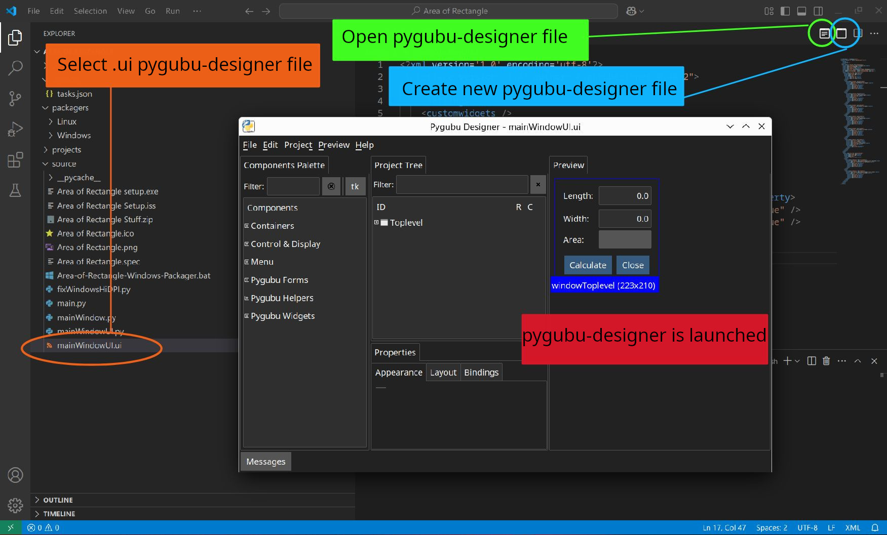

# Pygubu Designer Menu Bar

This Visual Code Studio extension allows [Pygubu Designer](https://github.com/alejandroautalan/pygubu-designer) to be easily launched from within the Visual Studio Code interface. Two extra buttons are added to the editor menu bar:

- &nbsp;&nbsp;Creates a new file in Pygubu Designer This launches pygubu-designer without a file argument.

  

- &nbsp;&nbsp;Opens a file in Pygubu Designer. This launches pygubu-designer with the current file passed as an argument. This button will only appear if a .ui file (pygubu user interface file) is currently selected in the editor.

## Features

Select a .ui pygubu-designer file in the project and open it from a button in the editor menu bar.

> 

## Requirements

[pygubu](https://github.com/alejandroautalan/pygubu) and [pygubu-designer](https://github.com/alejandroautalan/pygubu-designer) need to be installed. `pygubu-designer` needs to be in your `PATH`.

`Pygubu` is a [RAD tool](https://en.wikipedia.org/wiki/Rapid_application_development) to enable *quick* and *easy development of user interfaces* for the Python's `tkinter` module.

## Release Notes

### 1.0.0

Initial release.

## License

Copyright &copy; 2025 Robert J. Joynt.

The <a href="https://github.com/Jalopy-Tech/Pygubu-Designer-Menu-Bar-VSCode-Extension/blob/master/LICENSE.md">Pygubu Deisigner Menu Bar VSCode Extension license</a> uses the GPLv3 Open Source License.

## Contact

For further inquires, please email: robertjjoynt@gmail.com .

---

